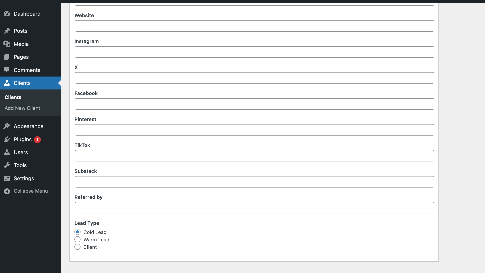
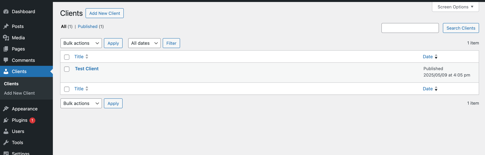

# Freelance Client Dashboard
This is a WordPress plugin with an admin panel for freelancers that allows them to manage their clients and projects.
## Project Overview
Freelance Client Dashboard is a WordPress plugin that's designed to give a freelancer a better view of their business in
their WordPress dashboard. I started this project as a challenge to develop my WordPress design
and development skills, while fully intending to publish this as a real product once the
MVP is finished.

The following technologies were used during development:

* PhpStorm
* PHP
* HTML
* Git/GitHub

## Development
I started developing this WordPress plugin to help freelancers fully integrate project management
within a system that was already working for them, especially those freelancers using
WordPress as their CMS.

My primarily goal for this project is to create a final product that gives freelancers
an easy system to navigate their project management needs, from storing important client
and lead data on the dashboard to simplifying communication with their clients about
ongoing projects.

I began development on this project May 9, 2025, and further development continues to make
it a more polished and functional product.

## Solution Design
The design of this solution has two aspects:

1. The dashboard seen only by the freelancer that allows them to create a client database and easy method to communicate their status updates on projects.
2. Future implementation will also include the ability for clients to login to check status, upload files, digitally sign contracts, and start new projects.

## Current Screenshots
### Client Entry/Edit

### Client List
